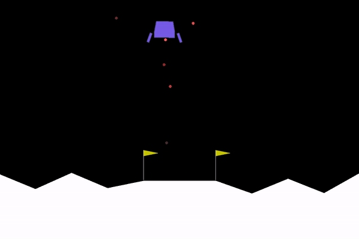
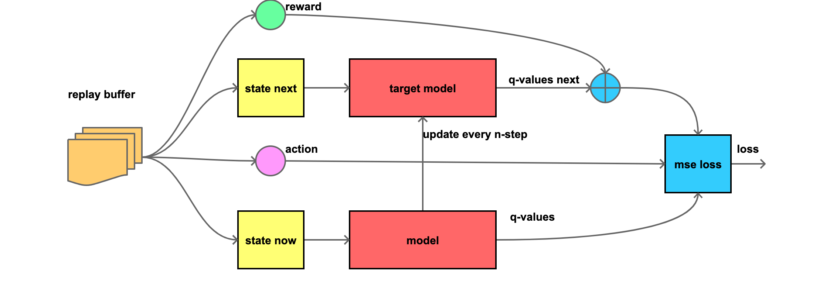
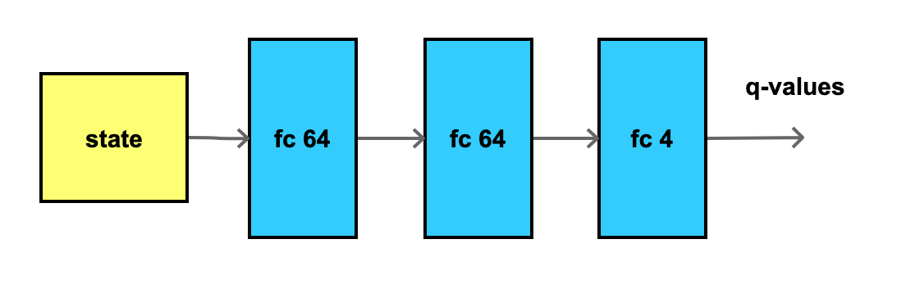
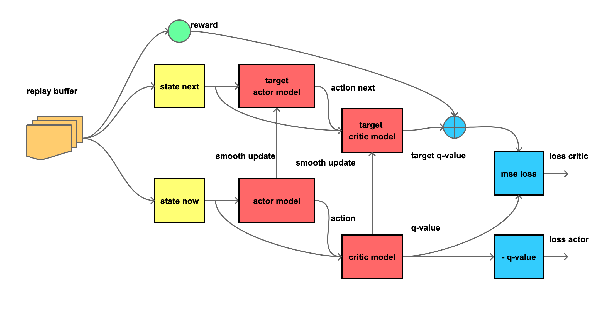
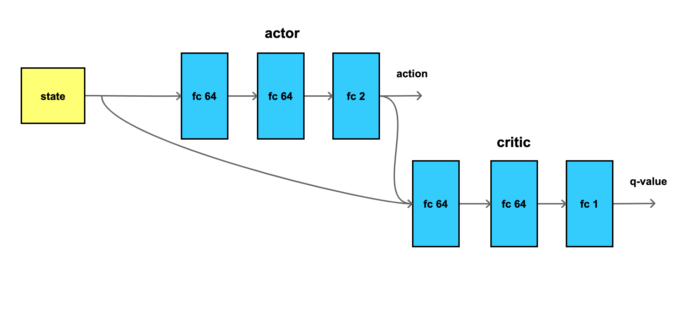

# reinforcement learning tutorial

short tutorial for basic deep reinforcement learning

- minimalistic implementation of DQN and DDPG

## dqn - discrete action space

### model architecture

- 3 layers
- ReLU activation
- xavier weight init, zero bias

## ddpg - continuous action space

### model architecture

- 3 layers 
- ReLU activation
- xavier weight init, zero bias
- actor output layer init range <-0.3, 0.3>, with tanh
- critic output layer init range <-0.003, 0.003>

